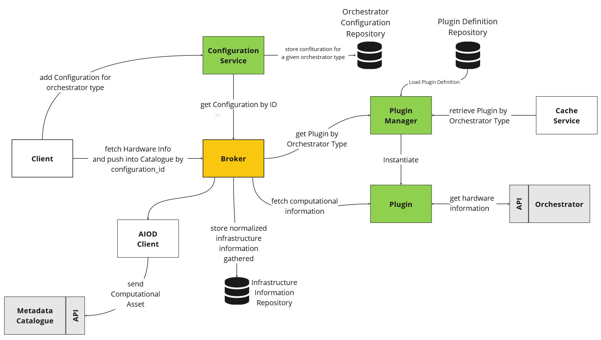

## HW Agent Connectors PoC (Draft, WIP)

HW Agnet API PoC based on Connector architecture.

## Plugin Architecture



## Plugin Manager Configuration


| **Configuration Option**     | **Description and Purpose**                                                                      | **Default Value**                                                                                 |
|-------------------------------|--------------------------------------------------------------------------------------------------|---------------------------------------------------------------------------------------------------|
| `ExcludeDirectories`          | List of directories to exclude during processing. Prevents processing of unnecessary or irrelevant directories. | `- '__pycache__'`<br>`- '.git'`                                                                   |
| `AllowedOrchestratorTypes`    | List of orchestrator types that the Plugin Manager supports. Restricts recognized orchestrator types for safety and compatibility. | `- kubernetes`<br>`- openstack`<br>`- slurm`                                                     |
| `PluginsDirectory` (Optional) | Directory where plugins are stored. If not set, defaults to the system's default plugin path. Allows specifying a custom directory for plugins. | `plugins`                                                                         |
| `DynamicDependenciesLoading`  | Enables or disables dynamic loading of dependencies at runtime. Controls whether dependencies are dynamically loaded or pre-installed. (future improvement) | `false`                                                                                           |


## Plugin Definition & Implementation


The plugin architecture consists of two primary components: 

1. **Plugin Definition File**  
   A YAML file that outlines the plugin's metadata and structure. This file includes:  

| **Attribute Name**   | **Description**                                               | **Type**        | **Mandatory** |
|-----------------------|---------------------------------------------------------------|-----------------|---------------|
| `name`               | The name of the plugin.                                       | string          | Yes           |
| `orchestrator_type`  | The type of orchestrator this plugin handles.                 | string          | Yes           |
| `module`             | The importable module path for the plugin.                    | string          | Yes           |
| `documentation`      | Documentation metadata for the plugin.                        | object          | Yes           |
| `documentation.description` | A description of the plugin.                            | string          | Yes           |
| `documentation.author`      | The author of the plugin.                               | string          | Yes           |
| `documentation.version`     | The version of the plugin.                              | string          | Yes           |
| `dependencies`       | List of dependencies required by the plugin.                 | array of strings| Yes           |
| `configuration`      | Additional configuration fields specific to this plugin.      | object          | Yes           |
| `connection_schema`  | A free-form object to store a complex connection schema, if needed. | object          | Yes           |


See [Plugin Definition JSON Schema](doc/plugin_definition/plugin_definition_schema.json)


2. **Plugin Implementation Class**  
   The implementation of the plugin is achieved by creating a class that extends the [`BasePlugin`](src/hw_agent/core/base_plugin.py) class. This class must implement the following methods:  
   - `fetch()`: Collects raw infrastructure data.  
   - `fetch_and_transform()`: Collects and transforms the raw data into the AIOD model `ComputationalAsset`.  

This structure ensures consistency across plugins while maintaining flexibility for custom functionality.


As an example of definition for an Openstack plugin, with the Connectoion Schema defined with the information needed to connect to the Openstack orchestrator.

```yaml
name: Sample Plugin
orchestrator_type: openstack   
module: hw_agent.plugins.openstack.openstack_plugin
documentation:
    description: Collects hardware information from Openstack tenants
    author: Author
    version: 1.0.0  (2015-01-01)
dependencies:   
    - openstacksdk
configuration: # Custom configuration for Openstack
    client_socket_timeout: 10   
    verify: false
connection_schema: # JSON Schema for Openstack
    type: object  
    properties:
        auth_url:   
            description: The OpenStack authentication URL.
            type: string
        username:       
            description: The OpenStack username.
            type: string
        password:       
            description: The OpenStack password.
            type: string
        project_name:   
            description: The OpenStack project name.
            type: string
        user_domain_name:   
            description: The OpenStack user domain name.    
            type: string
        region_name:   
            description: The OpenStack region name.    
            type: string    
``` 


## Local installation

1. Prepare the environment for development and configure environment variables.

```python
python -m venv venv
source venv/bin/activate
python -m pip install -r requirements.txt
```

Copy `.env.example` file to `.env` and configure the environment variables as needed.


2. Install dependencies
```bash
pip install -r requirements.txt
```

3. Run the application
```bash
python src/main.py --reload
```

4. Check the application on [http://localhost:8000/docs](http://localhost:8000/docs)    

## Run the application on Docker

1. Build and run the application using Docker Compose.

Build the image with the following command
```bash 
docker compose up --build
```

2. Check the application on [http://localhost:8000/docs](http://localhost:8000/docs)

2. Stop the application

```bash
docker compose down
```

## Test the Application

Follow the link to the Swagger UI [http://localhost:8000/docs](http://localhost:8000/docs)


## Run the Unit Tests

Run the unit tests with the following command on the root folder:
```bash
pytest
```


## Important when configuring Keycloak

Keycloak role needed to add or edit assets: 'edit_aiod_resources'
- Add new role to the client 
- Assign new role to the service account


## Future Improvements

- Dynamic loading of the orchestrator type based on the configuration of the different plugins (Optional)
